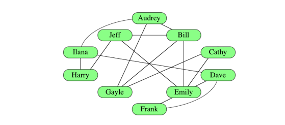
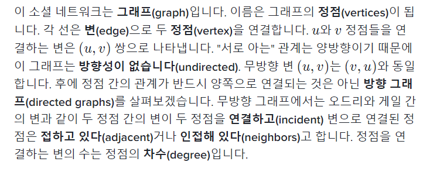
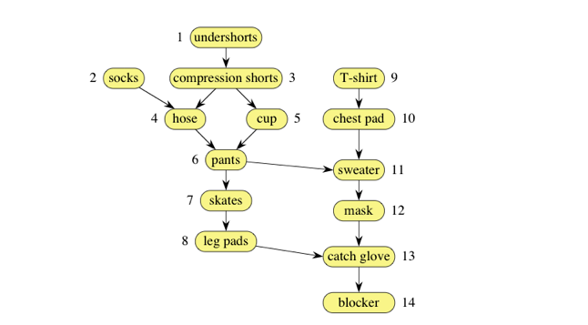
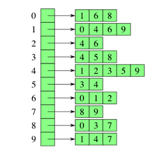
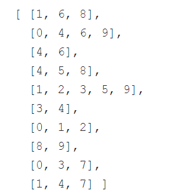

## Review Algorithms  & Data Structure  
___  

### 이진 검색(Binary Search)  
순차적인 항목 리스트에서 원하는 항목을 찾기에 효율적인 알고리즘.이 검색법은 후보 범위를 하나로 좁힐 때까지 찾고자 하는 항목을 포함하고 있는 리스트를 반으로 나누는 과정을 계속 반복.  

	Time complexity: O(logN)

### 선택 정렬(Selected Sort)  
주어진 데이터에서 최소값을 찾이서 그 값을 맨 앞에 위치한 값과 바꾼다. 그 후 맨 처음 위치한 값을 뺀 나머지 값들을 같은 방법으로 바꾼다.  

	Time complexity  O(N^2)	

### 삽입 정렬(Insertion Sort)
첫 숫자는 두고 두 번째 자리 숫자부터 그 숫자가 첫 숫자보다 비교해 크면 첫 숫자 오른쪽에, 작으면 왼쪽에 넣은 후 다시 세 번째 자리 숫자를 뽑아서 앞의 두 숫자와 크기를 비교해서 알맞은 자리에 넣는 것을 반복 해서 정렬 하는 알고리즘.  

	Time complexity: O(N^2)	

### Merge Sort
Base on Divide and Conquer.  
>	1. Divide by finding the number q of the position midway between p and r.  
>	   Do this step the same way we found the midpoint in binary search: add p and r, divide by 2, and round down.  

> 	2. Conquer by recursively sorting the subarrays in each of the two subproblems created by the divide step.  
>	   that is, recursively sort the subarray array[p..q] and recursively sort the subarray array[q+1..r].  

>	3. Combine by merging the two sorted subarrays back into the single sorted subarray array[p..r]  

>	- condition of exit: p < r  
>	- need to more memory  

	Time complexity: O(NlogN)  

### Quick Sort
Base on Divide and Conquer.
> merge sort은 분할 단계에서 거의 아무 것도 하지 않고, 모든 중요한 작업은 결합 단계에서 일어나는 반면, quick sort는 반대로, 모든 중요한 작업은 분할 단계에서 일어난다.

> 1. Divide: Pivot , Partitioning ( less than pivot is to left)  
> 2. Conquer: recursively sorting the subarrays array base on pivot  
> 3. Combine: doing nothing  

	Time complexity: O(NlogN)  , Worst N^2  

### Graph
> from Khan Academy
> ##### Graph
>>   
>>   
> ##### weighted Graph  
>>   
> ##### directed Graph (directed acyclic graph)
>>   

> ##### Presentation Graph
>> 3 ways : 연결선 리스트, 인접 행렬, 인접 리스트  
>> 인접 리스트  
>>    

### 너비우선탐색(Breadth-first Search)
> 너비 우선 탐색은 각 정점 v에 다음과 같은 두 개의 값을 할당합니다:  
>> 거리: 소스 정점에서 정점 v 에 이르는 아무 경로에 있는 변의 최소 수를 나타냅니다.  
>> 선행 정점: 소스 정점에서 가장 짧은 경로 내 v 의 선행자 정점. 소스 정점의 선행자는 null과 같은 특수 값을 가지는데 이는 선행 정점이 없음을 의미합니다.  

> 정점에 이미 가봤는지 여부 : 거리가 현재 null이 아니면 이미 탐색한 정점  
> 어떤 정점을 이미 가봤지만 그 곳에서 출발한 적은 없는지 어떻게 확인: queue  ( k+1 의 정점으로 가기 전에, k 의 모든 정점을 가는것을 보장하는 방법)  

	Time complexity: O(V+E)

### 깊이 우선 탐색  

	정리 예정  

### Bullble Sort  
두 수를 비교해서 위치를 서로 바꾸는 알고리즘.  

	Time complexity: O(N^2)  

### Counting Sort  
숫자 개수를 센 후 , 누적 합을 구하고 , 누적합을 구하는 인덱스를 바탕으로  결과에 숫자를 저장. space complexity가 worst 이다.  

	Time complexity: O(n+k). K is maximum value of n  
	Space complexity: K  

### Radix Sort  
자리수를 비교해서 정렬. 부동 소수점과 같은 자리수가 없는 것은 정렬 할 수 없다.  
	LSD(가장작은자리수비교), MSD(가장큰자리수비교)  

	Time complexity: O(dn). d is maximum value of n  

### Linked List  
Data Structure 

